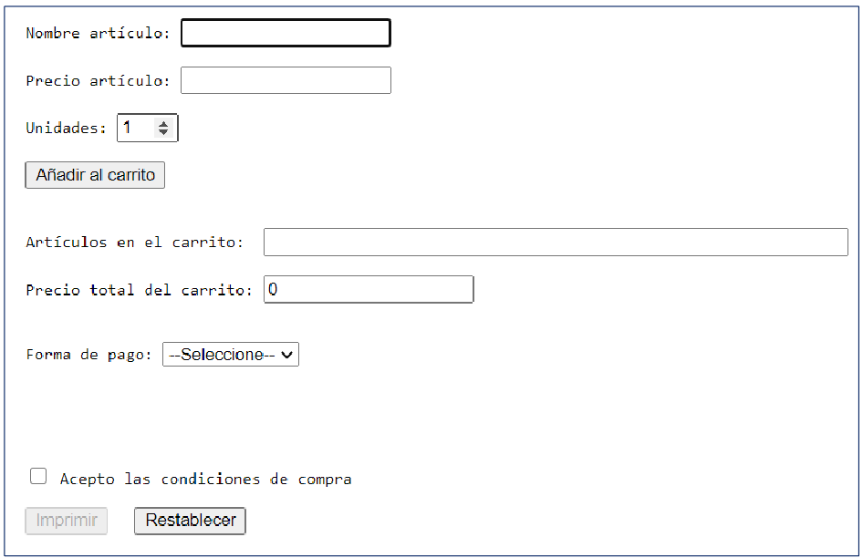

# AE-1. Carrito de la compra


## Integrantes del grupo

Ignacio Viseras Riego
Antonio Pastor
Luz Lozano

Enlace al proyecto → [Github](https://github.com/ignacioviseras/2-DAM/tree/main/Desarrollo%20de%20Interfaces/Carrito%20Compra)

# Requisitos de la creación del formulario.

Crea una página web dinámica usando JavaScript que implemente las siguientes especificaciones:

1.   Que conste de los elementos indicados en la imagen, 



1. Cuando el usuario rellene las 3 primeras cajas y haga clic en el botón de Añadir deberá sumar el precio de los artículos y las unidades, esta información se almacenará para que se vea finalmente el total de la compra y precio de la misma. Cada vez que se usa el botón deberá desaparecer la información de las 3 primeras cajas para poder escribir, poniendo el foco en la primera, Nombre del artículo.

1. El formulario tiene que tener las siguientes validaciones,
    - Solo se podrán añadir productos si se completa la información tanto de nombre como de precio. En caso contrario debe aparecer un mensaje de error y el foco sería la caja errónea.
    - En la caja de precio solo podrá aceptar datos numéricos, sino saltará un error.
2. Habrá dos medios de pago, Efectivo y Tarjeta, en cada opción deberá aparecer una vista distinta. 
3. El botón imprimir se habilitará una vez aceptadas las condiciones de compra. 
4. Una vez pulsado el botón imprimir debe mostrar una ventana en la que informe de la lista de productos y el medio de pago. En caso de no haber seleccionado forma de pago aparecerá una ventana de aviso. 
5. Con el botón restablecer se resetearán todas las cajas para poder introducir nuevos productos. Incluida la caja de precio total, que se iniciará a 0.

Nuestro formulario en vista cliente tiene este resultado:

<p align="center">
  
</p>

Nuestro formulario consta de 3 archivos diferenciados. Un archivo Html donde va el código relacionado con la vista. Complementando al archivo Html tenemos una hoja de estilos Css que hemos optado por un estilo oscuro con contraste de azul  y rojo para los errores.

Para poder controlar los elementos del formulario, vamos a complementarlo con JavaScript. Manejaremos funcionalidades y errores que se puedan producir durante el funcionamiento.

Los 3 campos principales que hay antes de botón añadir están ejecutando una función en la que se valida el contenido que hay escrito.

En la primera parte, antes de dar al botón añadir tenemos control de errores tanto por campo vacío como por campo incorrectamente relleno, con caracteres que no concuerdan con los datos que pedimos, lo controlamos con las validaciones del siguiente código.

Como se menciono antes cada campo requiere de 2 validaciones

1. Que el campo no este vacío.
2. Que cumpla el filtro correspondiente a su campo.

En caso de no cumplir las 2 condiciones se modificara el contenido de un spam para mostrar un mensaje avisando del error.

Funcionamiento de los filtros.

1. filtroNombre
    
    ^ indica que el patrón debe iniciar con los caracteres dentro de los corchetes
    
    [A-Z] indica que los caracteres admitidos son letras del alfabeto
    
    '+' indica que los caracteres dentro de los corchetes se pueden repetir
    
    $ indica que el patrón finaliza con los caracteres que están dentro de los corchetes.
    
    i indica que validaremos letras mayúsculas y minúsculas (case-insensitive)
    
2. filtroPrecio
    
    Además de las reglas anteriores tiene unas nuevas.
    
    +? indica que lo que viene a continuación puede llegar a aparecer pero no esta obligado a que esto ocurra.
    
    ([.][0-9]{2})
    
    [.] Aquí indicamos que el tramo esta obligado a empiece por un punto
    
    [0-9] indica que los caracteres admitidos son solo números
    
    {2} Y que solo podamos tener 2 números
    

El campo de cantidad además de la validación de no estar vacío solo tiene una en la que comprobamos que el numero insertado sea superior a 0 ya que no puedes comprar -5 quesos

```jsx
function validarFormulario() {
  filtroNombre = /^[A-Z]+$/i;
  filtroPrecio = /^[0-9]+?([.][0-9]{2})?$/;
  if (nombreProducto.value.trim() == "") {
    menError.textContent = "Campo por rellenar";
    return false;
  }
  menError.textContent = "";
  if (!nombreProducto.value.match(filtroNombre)) {
    menError.textContent = "Solo caracarteres alfabéticos";
    return false;
  }
  if (precioArticluo.value.trim() == "") {
    menErrorPrecio.textContent = "Campo por rellenar";
    return false;
  }
  menErrorPrecio.textContent = "";
  if (precioArticluo.value.trim() <= 0) {
    menErrorPrecio.textContent = "Tiene que se un numero positivo";
    return false;
  }
  if (!precioArticluo.value.match(filtroPrecio)) {
    menErrorPrecio.textContent = "introduce bien el numero 2 o 2.15";
    return false;
  }
  if (cantidad.value.trim() == "") {
    menErrorCantidad.textContent = "Campo por rellenar";
    return false;
  }
  menErrorCantidad.textContent = "";
  if (cantidad.value.trim() <= 0) {
    menErrorCantidad.textContent = "Tiene que se un numero positivo";
    return false;
  }
  return true;
}
```

Al dar al botón añadir los artículos se colocan en una variable global que se llama lista y se realiza la suma del precio del articulo y la cantidad una vez tengamos ese resultado lo añadimos a una variable global llamada total

Esto ocurre de la siguiente manera

1. En el if ese estamos comprobando que la validarFormulario() nos devuelva un true esto significaría que todos los valores de los campos están bien escritos.
2. En una variable llamada recibirLista vamos guardando los valores nuevos manteniendo los anteriores todo esto con una separación de “, ” pero esto quedaría de tal manera 
”pan, agua, arroz, “ y claro no queda bonito devolver la lista entera con la coma y espacio final
    
    Para eso usamos esta linea 
      listado = recibirLista.substring(0, recibirLista.length - 2);
    Aquí lo que estamos haciendo es recibir la cadena entera ver la longitud que tiene u quitarle las 2 ultimas posiciones que siempre serán la “, ” el resultado final lo almacenaremos en la variable listado.
    
3. Después vamos añadiendo el total de la operación “precio * cantidad” y añadimos el valor que tenia anteriormente.
Enviamos el resultado a las cajas de lista y del precio para que así se pueda visualizar
(la caja del total recibirá el dato pero solo con 2 decimales)
4. Y por ultimo limpiamos los campos del formulario para así insertar un nuevo producto además le dejamos la casilla del producto seleccionada.
5. Lo que hacemos al final es comprobar que si le intentas dar al botón de añadir y uno de los campos esta vacío te seleccione automáticamente en ellos para que así lo completes.

```jsx
function guardar() {
  if (validarFormulario() != false) {
    recibirLista += nombreProducto.value + ", ";
    listado = recibirLista.substring(0, recibirLista.length - 2);
    total += precioArticluo.value * cantidad.value;
    document.getElementById("listaCarri").value = listado;
    document.getElementById("precioCarri").value = total.toFixed(2);
    nombreProducto.value = "";
    precioArticluo.value = "";
    cantidad.value = "";
    nombreProducto.focus();
  }else if (nombreProducto.value == "") {
    nombreProducto.focus();
  }else if (precioArticluo.value == "") {
    precioArticluo.focus();
  }else if (cantidad.value == "") {
    cantidad.focus();
  }
}
```

Para mostrar el método de pago seleccionado tenemos que partir de la base de que se tienen en encontrar ocultos los elementos usando el css.

<p align="center">
  
</p>

<p align="center">
  
</p>

La manera de mostrar el elemento seleccionado es el siguiente.

1. Guardamos el valor del campo seleccionado
2. Comprobamos si el valor de ese campo es tarjeta, de ser así hacemos que se muestre un div inicial y le concretamos el tamaño y la posición de este.
Luego hacemos que se pueda ver el formulario de la tarjeta
Y que no se pueda ver el de importe.
3. En caso de que el valor no sea tarjeta mostrara el campo de importe y le añadiremos el valor a la caja de texto

```jsx
function ocultarTarjeta() {
  const tipoPago = document.getElementsByName("pago")[0].value;
  let datosTarjeta = document.getElementById("datosTarjeta");
  let payBox = document.getElementById("payBox");

  if (tipoPago === 'tarjeta') {
    payBox.style.display = 'block';
    payBox.style.height= '316px';
    payBox.style.top= '160px';
    payBox.style.left= '110px';
    datosTarjeta.style.display = 'block';
    importeT.style.display = 'none';
  } else{
    payBox.style.display = 'block';
    payBox.style.height= '165px';
    payBox.style.top= '200px';
    payBox.style.left= '120px';
    importeT.style.display = 'block';
    datosTarjeta.style.display = 'none';
    document.getElementById("importe").value = total.toFixed(2) + " €";
  }
}
```

En caso de Seleccionar la opción de Tarjeta nos devolverá el siguiente formulario.
Funciona de la misma manera que el formulario de productos pero tiene diferentes filtros.

<p align="center">
  
</p>

filtroNumeroTarjeta

+ Aquí validamos que solo se puedan introducir 16 números.

filtroNombre

+ Validamos que se tenga que introducir 3 tramos de texto separados por espacios.
+ Validamos que los tramos de textos como mínimo tienen que contener 1 letra y no tienen máximo.

filtroCaducidad

+ El primer tramo de 2 números esta separado del segundo que también son solo 2 números por una barra.

filtroCVC

+ Admitimos solo la introducción de 3 números.

```jsx
function validacionTarjeta() {
  filtroNumeroTarjeta = /^[0-9]{16}$/;
  filtroNombre = /[a-zA-Z]{0,} [a-zA-Z]{0,} [a-zA-Z]{0,}/;
  filtroCaducidad = /^[0-9]{2}\/[0-9]{2}$/;
  filtroCVC = /^[0-9]{3}$/
  if (numeroTarjeta.value.trim() == "") {
    errorTarjeta.textContent = "Campo por rellenar";
    return false;
  }
  errorTarjeta.textContent = "";
  if (!numeroTarjeta.value.match(filtroNumeroTarjeta)) {
    errorTarjeta.textContent = "Numero de Tarjeta Erroneo";
    return false;
  }
  if (nombreTitular.value.trim() == "") {
    errorTitular.textContent = "Campo por rellenar";
    return false;
  }
  errorTitular.textContent = "";
  if (!nombreTitular.value.match(filtroNombre)) {
    errorTitular.textContent = "Tienes que introducir 3 nombres sin caracteres especiales";
    return false;
  }
  if (caducidad.value.trim() == "") {
    errorCaducidad.textContent = "Campo por rellenar";
    return false;
  }
  errorCaducidad.textContent = "";
  if (!caducidad.value.match(filtroCaducidad)) {
    errorCaducidad.textContent = "Formato de caducidad xx/xx";
    return false;
  }
  if (cvc.value.trim() == "") {
    errorCVC.textContent = "Campo por rellenar";
    return false;
  }
  errorCVC.textContent = "";
  if (!cvc.value.match(filtroCVC)) {
    errorCVC.textContent = "Formato de CVC xxx";
    return false;
  }
  return true;
}
```

Cuando le damos al botón de pagar se ejecuta la función de guardarTarjeta

Lo que hace es comprobar que la validación de los campos sea correcta.
De ser así añadiremos todos los valores en una variable global llamada Tarjeta, y mostraremos un texto que ponga pagado para que así se pueda ver que la operación se realizo con éxito.

```jsx
function guardarTarjeta(){
  if (validacionTarjeta() != false) {
    Tarjeta = [numeroTarjeta.value , nombreTitular.value, caducidad.value, cvc.value];
    pagado.textContent = "PAGADO";
  }
}
```

Si queremos imprimir los datos antes tendríamos que aceptar las condiciones

<p align="center">
    
</p>

1. Creamos una variable que se llamara tipoPago aquí almacenaremos el valor seleccionado del select.

2. Luego comprobamos que si el checkbox esta desactivado, de ser así deshabilitáremos la utilidad del botón.

3. Para **activar** el botón de imprimir lo que hacemos es comprobar que en las variables: listado y total tienen contenido ademas de eso tambien comprobamos que tipoPago sea diferente a Seleccionado ya que tiene que introducir un metodo de pago.

4. Una vez comprobado eso se nos activara el botón.

5. De lo contrario desmarcaremos el checkbox y soltaremos un alert avisando de que tienen que completar los campos

```jsx
function terminos(){
  let tipoPago = document.getElementsByName("pago")[0].value;
  if (document.getElementById("acepta").checked == false)
    document.getElementById("imprimir").disabled = true;
  if (listado != undefined && total != 0 && tipoPago != 'Selecciona') {
    document.getElementById("imprimir").disabled = false;
  }else{
    document.getElementById("acepta").checked = false;
    alert("Tienes que introducir elementos en el carrito y sus precios")
  }
}
```

Cuando hagamos click en el botón de imprimir ejecutaremos la función imprimir.

Esta función comprueba que el checkbox esta activado de ser así mostrara un alert con los valores de los artículos del carrito, el precio que tendrá en total y la forma de pago que seleccionaron.

En caso de presionar el botón y el checkbox no este activado se deshabilitara el botón.

```jsx
function imprimir(){
  if (document.getElementById("acepta").checked == true) {
    alert("Articulos en el carrito " + listado + ". Precio " + total.toFixed(2) + "€ " 
    + "Forma de pago: "+ document.getElementsByName("pago")[0].value)
  } else {
    document.getElementById("imprimir").disabled=true;
  }
}
```

El botón de restablecer ejecuta la función resetForm()

Esta función lo que hace es obtener todo el contenido del id que se le pasa y resetear los valores

<p align="center">
    
</p>

```jsx
function resetForm(){
  document.getElementById("div-Articulos").reset();
}
```
