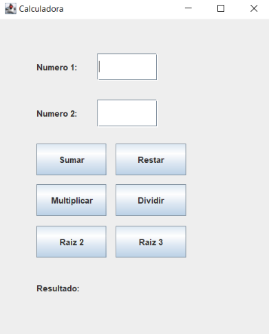

# AE-2. Calculadora

Para esta actividad se nos pide una GUI en la que veremos los siguientes contenidos.


<p align="center">
  
</p>

Para eso tendremos que utilizar la librería de Swing.

## 🗃️Vista

---

Para la parte vista tendremos que **crearnos una clase que extienda de JFrame** y declararemos todos los componentes que necesitaremos en la ventana.

```java
public class VentanaPrincipal extends JFrame{
  private JLabel icono, numero1, numero2, resultado, valorResultado;
  private JTextField txtN1, txtN2;
  private JButton btnSuma, btnResta, btnMulti, btnDiv, btnRaiz2, btnRaiz3;
}
```

Además crearemos un constructor en el que realizaremos la **creación de la ventana**.

1. setSize→ Damos las dimensiones de la ventana.
2. setLocationRelativeTo→ Utilizando la **opción null** hacemos que la ventana se ubique en el centro de la pantalla.
3. setDefaultCloseOperation→ Utilizando la opción EXIT_ON_CLOSE hacemos que la aplicación se cierre al pulsar la x.
4. setTitle→ Damos un titulo a la aplicación (se vera en la parte superior izquierda).
5. setIconImage→ le damos un icono a la aplicación (este se vera tanto en la barra de herramientas como arriba a la izquierda).
6. setResizable→ hacemos que no se pueda cambiar de tamaño la ventana de la app.
7. setLayout→ desactivamos el layout.
8. getContentPane→ Obtenemos el contenido de la ventana.
    - setBackground→ Le damos color al fondo.
9. inicializarComponentes→ Cargamos los componentes.
10. setVisible→ Hacemos que la ventana sea visible.

```java
public VentanaPrincipal() {
  setSize(320, 476);//1
  setLocationRelativeTo(null);//2
  setDefaultCloseOperation(EXIT_ON_CLOSE);//3
  setTitle("Calculadora");//4
  setIconImage(Toolkit.getDefaultToolkit().getImage("src/fotos/solucion.png"));//5
  setResizable(false);//6
  setLayout(null);//7
  getContentPane().setBackground(new Color(90, 141, 61));//8
	
  inicializarComponentes();//9
  setVisible(true);//10
}
```

Ahora utilizando las variables que declaramos anteriormente crearemos los componentes de la ventana.

Para eso tendremos que seguir 3 pasos imprescindibles:

1. Creación
2. Dar una ubicación y un tamaño
3. Añadir el componente a la ventana

```java
private void inicializarComponentes() {
  //icono inicio
  icono = new JLabel (new ImageIcon("src/fotos/inicio.gif"));//1
  icono.setBounds(98, 6, 112, 112);//2
  add(icono);//3
	
  //numero1
  numero1 = new JLabel("Numero 1");//1
  numero1.setBounds(58, 144, 69, 14);//2
  numero1.setFont(new Font(null, Font.BOLD, 14));//tamaño texto
  numero1.setForeground(new Color(0, 0, 0));//color texto -> negro
  add(numero1);//3
	
	
  //CajaNumero1
  txtN1 = new JTextField();//1
  txtN1.setBounds(169, 144, 79, 20);//2
  txtN1.requestFocus();//hacemos que este seleccionada la caja
  add(txtN1);//3
	
  //numero2
  numero2 = new JLabel("Numero 2");//1
  numero2.setBounds(58, 185, 69, 14);//2
  numero2.setFont(new Font(null, Font.BOLD, 14));//tamaño texto
  numero2.setForeground(new Color(0, 0, 0));//color texto -> negro
  add(numero2);//3
	
  //CajaNumero2
  txtN2 = new JTextField();//1
  txtN2.setBounds(169, 185, 79, 20);//2
  add(txtN2);//3
	
	
  //-----Botones-----
  //botonSuma
  btnSuma = new JButton("Sumar");//1
  btnSuma.setBounds(58, 251, 82, 23);//2
  btnSuma.setBackground(new Color(184, 189, 122));//color del boton
  add(btnSuma);//3
	
  //botonResta
  btnResta = new JButton("Restar");//1
  btnResta.setBounds(169, 251, 82, 23);//2
  btnResta.setBackground(new Color(184, 189, 122));//color del boton
  add(btnResta);//3
	
  //botonMultiplicacion
  btnMulti = new JButton("Múltiplicar");//1
  btnMulti.setBounds(58, 285, 82, 23);//2
  btnMulti.setFont(new Font(null, Font.PLAIN, 11));//hacemos q se pueda visualizar el texto en la caja
  btnMulti.setBackground(new Color(184, 189, 122));//color del boton
  add(btnMulti);//3
	
  //botonDivision
  btnDiv = new JButton("Dividir");//1
  btnDiv.setBounds(169, 285, 82, 23);//2
  btnDiv.setBackground(new Color(184, 189, 122));//color del boton
  add(btnDiv);//3
	
  //botonRaiz2
  btnRaiz2 = new JButton("Raiz 2");//1
  btnRaiz2.setBounds(58, 319, 82, 23);//2
  btnRaiz2.setBackground(new Color(184, 189, 122));//color del boton
  add(btnRaiz2);//3
	
  //botonRaiz3
  btnRaiz3 = new JButton("Raiz 3");//1
  btnRaiz3.setBounds(169, 319, 82, 23);//2
  btnRaiz3.setBackground(new Color(184, 189, 122));//color del boton
  add(btnRaiz3);//3

  //-----Resultado-----
  //tenemos que hacer un try catch ya que vamos a importar
  //una fuente de texto en caso de q no la consiga usar saltaran los errores
  try {
    Font fuente = Font.createFont(Font.TRUETYPE_FONT, getClass().getResourceAsStream("../fuentes/Robotica.ttf"));
    resultado = new JLabel("Resultado");
    resultado.setBounds(105, 370, 100, 14);
    resultado.setHorizontalAlignment(SwingConstants.CENTER);
    resultado.setFont(fuente.deriveFont(Font.PLAIN, 14));//tamaño texto
    resultado.setForeground(new Color(0, 0, 0));//color texto -> negro
    add(resultado);
			
    valorResultado = new JLabel("");
    valorResultado.setBounds(125, 395, 60, 14);
    valorResultado.setHorizontalAlignment(SwingConstants.CENTER);
    valorResultado.setFont(fuente.deriveFont(Font.PLAIN, 14));//tamaño texto
    valorResultado.setForeground(new Color(0, 0, 0));//color texto -> negro
    add(valorResultado);
  } catch (FontFormatException  e) {
    e.printStackTrace();
  } catch (IOException e) {
    e.printStackTrace();
  }
}
```

Nos creamos un método donde le pasaremos todos los botones al manejador de eventos para que este pueda tramitar sus acciones.

```java
public void establecerManejador(ManejadorEventos manejador) {
  btnSuma.addActionListener(manejador);
  btnResta.addActionListener(manejador);
  btnMulti.addActionListener(manejador);
  btnDiv.addActionListener(manejador);
  btnRaiz2.addActionListener(manejador);
  btnRaiz3.addActionListener(manejador);
}
```

Cuando ejecutemos el programa tendremos el siguiente resultado.


<p align="center">
  
</p>

## 🗃️Controlador

# Main

Ahora mismo el manejador necesita a la ventana y viceversa de tal manera que cada uno necesita una referencia al otro.

```java
public class Main {

  public static void main(String[] args) {
    VentanaPrincipal ventanaPrincip = new VentanaPrincipal();
	
    //Comunicamos el manejadorEventos con la ventana
    //De esta manera cuando se pulse un boton podremos controlar sus acciones
    ManejadorEventos manejador = new ManejadorEventos(ventanaPrincip);
    ventanaPrincip.establecerManejador(manejador);
  }
}
```

# Manejador de Eventos

---

En esta parte es donde vamos a hacer la recepción de los datos, acción de los botones y mostraremos el resultado.

Esta clase se construirá de la siguiente forma:

La clase tiene que implementar el ActionListener además de eso añadimos un objeto de la clase VentanaPrincipal la cual utilizaremos en el constructor ManejadorEventos

```java
public class ManejadorEventos implements ActionListener{
  private VentanaPrincipal ventana;
	
  public ManejadorEventos(VentanaPrincipal ventana) {
    this.ventana = ventana;
  }
}
```

## Validaciones

Se nos pide validar que los datos insertados en los JLabel (cajas de texto) estén validados para eso hacemos 2 tipos de validaciones

- isNumeric
    
    Con esta validación lo que vamos a evitar es que si en el JTextField se inserta una letra no se rompa el programa ya que estaríamos intentando introducir un String en un Double.
    
    ```java
    public Boolean isNumeric(String str) {
      boolean result;
    	
      try {
        Double.parseDouble(str);
        result = true;
      }catch (Exception e) {
        result = false;
      }
      return result;
    }
    ```
    

- validarcampos
    
    Con esta validación vamos a filtrar los datos que se van a introducir en la caja
    
    ```java
    public Boolean validarcampos(Double numero) {
      Pattern p = Pattern.compile("^[0-9]+([.][0-9]+)?$");
      Matcher m = p.matcher(numero.toString());
    
      return m.matches();
    }
    ```
    

## Acción de Botones

Aquí es donde se ejecutan las diferentes acciones de los botones.

```java
@Override
public void actionPerformed(ActionEvent e) {
  //aqui se localizara el codigo de todos los botones
}
```

- Suma
    1. Comprobamos que sea el botón pulsado
    2. Comprobamos si esta vacía la caja de texto
        1. De ser así nos saltara un mensaje advirtiéndonos
        2. De lo contrario ejecutamos el else
    3. Validamos que sea un numero
        1. De ser así 
            1. Guardamos los datos en 2 variables Double
            2. Comprobamos con el validarcampos
                1. Si es correcto hacemos la operación, limpiamos las cajas y marcamos la  primera caja para que pueda seguir introduciendo datos.
                2. Si la validación no es correcta daremos un error de formato.
        2. De lo contrario nos advertirá de que lo introducido no es un numero.
    
    ```java
    if(e.getSource() == ventana.getBtnSuma()) {//1
      if(ventana.getTxtN1().getText().isEmpty() || ventana.getTxtN2().getText().isEmpty())//2
        JOptionPane.showMessageDialog(null, "Campo vacio", "Advertencia", JOptionPane.INFORMATION_MESSAGE);//2a
      else {//2b
        if((isNumeric(ventana.getTxtN1().getText()) && isNumeric(ventana.getTxtN2().getText()))) {//3
          Double n1 = Double.parseDouble(ventana.getTxtN1().getText());//3a-1
          Double n2 = Double.parseDouble(ventana.getTxtN2().getText());//3a-1
    			
          if(validarcampos(n1) && validarcampos(n2)) {//3a-2
            ventana.getValorResultado().setText(suma(n1, n2).toString());//3a-2-1
            ventana.getTxtN1().setText(null);//3a-2-1
            ventana.getTxtN2().setText(null);//3a-2-1
            ventana.getTxtN1().requestFocus();//3a-2-1
          }else {//3a-2-2
            JOptionPane.showMessageDialog(null, "Error de formato", "Advertencia", JOptionPane.INFORMATION_MESSAGE);
          }
      	}else {//3b
          JOptionPane.showMessageDialog(null, "Tienes que introducir numeros", "Advertencia", JOptionPane.INFORMATION_MESSAGE);
        }
    	}
    }
    ```
    
- Resta
    1. Comprobamos que sea el botón pulsado
    2. Comprobamos si esta vacía la caja de texto
        1. De ser así nos saltara un mensaje advirtiéndonos
        2. De lo contrario ejecutamos el else
    3. Validamos que sea un numero
        1. De ser así 
            1. Guardamos los datos en 2 variables Double
            2. Comprobamos con el validarcampos
                1. Si es correcto hacemos la operación, limpiamos las cajas y marcamos la  primera caja para que pueda seguir introduciendo datos.
                2. Si la validación no es correcta daremos un error de formato.
        2. De lo contrario nos advertirá de que lo introducido no es un numero.
    
    ```java
    if(e.getSource() == ventana.getBtnResta()) {//1
      if(ventana.getTxtN1().getText().isEmpty() || ventana.getTxtN2().getText().isEmpty())//2
        JOptionPane.showMessageDialog(null, "Campo vacio", "Advertencia", JOptionPane.INFORMATION_MESSAGE);//2a
      else {//2b
        if((isNumeric(ventana.getTxtN1().getText()) && isNumeric(ventana.getTxtN2().getText()))) {//3
          Double n1 = Double.parseDouble(ventana.getTxtN1().getText());//3a-1
          Double n2 = Double.parseDouble(ventana.getTxtN2().getText());//3a-1
    			
          if(validarcampos(n1) && validarcampos(n2)) {//3a-2
            ventana.getValorResultado().setText(resta(n1, n2).toString());//3a-2-1
            ventana.getTxtN1().setText(null);//3a-2-1
            ventana.getTxtN2().setText(null);//3a-2-1
            ventana.getTxtN1().requestFocus();//3a-2-1
          }else {//3a-2-2
            JOptionPane.showMessageDialog(null, "Error de formato", "Advertencia", JOptionPane.INFORMATION_MESSAGE);
          }
        }else {//3b
          JOptionPane.showMessageDialog(null, "Tienes que introducir numeros", "Advertencia", JOptionPane.INFORMATION_MESSAGE);
        }
      }
    }
    ```
    
- Multiplicación
    1. Comprobamos que sea el botón pulsado
    2. Comprobamos si esta vacía la caja de texto
        1. De ser así nos saltara un mensaje advirtiéndonos
        2. De lo contrario ejecutamos el else
    3. Validamos que sea un numero
        1. De ser así 
            1. Guardamos los datos en 2 variables Double
            2. Comprobamos con el validarcampos
                1. Si es correcto hacemos la operación, limpiamos las cajas y marcamos la  primera caja para que pueda seguir introduciendo datos.
                2. Si la validación no es correcta daremos un error de formato.
        2. De lo contrario nos advertirá de que lo introducido no es un numero.
    
    ```java
    if(e.getSource() == ventana.getBtnMulti()) {//1
      if(ventana.getTxtN1().getText().isEmpty() || ventana.getTxtN2().getText().isEmpty())//2
        JOptionPane.showMessageDialog(null, "Campo vacio", "Advertencia", JOptionPane.INFORMATION_MESSAGE);//2a
      else {//2b
        if((isNumeric(ventana.getTxtN1().getText()) && isNumeric(ventana.getTxtN2().getText()))) {//3
          Double n1 = Double.parseDouble(ventana.getTxtN1().getText());//3a-1
          Double n2 = Double.parseDouble(ventana.getTxtN2().getText());//3a-1
    			
          if(validarcampos(n1) && validarcampos(n2)) {//3a-2
            ventana.getValorResultado().setText(multi(n1, n2).toString());//3a-2-1
            ventana.getTxtN1().setText(null);//3a-2-1
            ventana.getTxtN2().setText(null);//3a-2-1
            ventana.getTxtN1().requestFocus();//3a-2-1
          }else {//3a-2-2
            JOptionPane.showMessageDialog(null, "Error de formato", "Advertencia", JOptionPane.INFORMATION_MESSAGE);
          }
        }else {//3b
          JOptionPane.showMessageDialog(null, "Tienes que introducir numeros", "Advertencia", JOptionPane.INFORMATION_MESSAGE);
        }
      }
    }
    ```
    
- División
    1. Comprobamos que sea el botón pulsado
    2. Comprobamos si esta vacía la caja de texto
        1. De ser así nos saltara un mensaje advirtiéndonos
        2. De lo contrario ejecutamos el else
    3. Validamos que sea un numero
        1. De ser así 
            1. Guardamos los datos en 2 variables Double
            2. Comprobamos con el validarcampos
                1. Si es correcto hacemos la operación, limpiamos las cajas y marcamos la  primera caja para que pueda seguir introduciendo datos.
                2. Si la validación no es correcta daremos un error de formato.
        2. De lo contrario nos advertirá de que lo introducido no es un numero.
    
    ```java
    if(e.getSource() == ventana.getBtnDiv()) {//1
      if(ventana.getTxtN1().getText().isEmpty() || ventana.getTxtN2().getText().isEmpty())//2
        JOptionPane.showMessageDialog(null, "Campo vacio", "Advertencia", JOptionPane.INFORMATION_MESSAGE);//2a
      else {//2b
        if((isNumeric(ventana.getTxtN1().getText()) && isNumeric(ventana.getTxtN2().getText()))) {//3
          Double n1 = Double.parseDouble(ventana.getTxtN1().getText());//3a-1
          Double n2 = Double.parseDouble(ventana.getTxtN2().getText());//3a-1
    			
          if(validarcampos(n1) && validarcampos(n2)) {//3a-2
            ventana.getValorResultado().setText(div(n1, n2).toString());//3a-2-1
            ventana.getTxtN1().setText(null);//3a-2-1
            ventana.getTxtN2().setText(null);//3a-2-1
            ventana.getTxtN1().requestFocus();//3a-2-1
          }else {//3a-2-2
            JOptionPane.showMessageDialog(null, "Error de formato", "Advertencia", JOptionPane.INFORMATION_MESSAGE);
          }
      }else {//3b
          JOptionPane.showMessageDialog(null, "Tienes que introducir numeros", "Advertencia", JOptionPane.INFORMATION_MESSAGE);
        }
      }
    }
    ```
    
- Raíz 2
    1. Comprobamos que sea el botón pulsado
    2. Soltamos un mensaje avisando de que la opción no esta disponible.
    
    ```java
    if(e.getSource() == ventana.getBtnRaiz2()) {//1
      JOptionPane.showMessageDialog(null, "Funcionalidad no disponible", "Raiz Cuadrada", JOptionPane.INFORMATION_MESSAGE);//2
    }
    ```
    
- Raíz 3
    1. Comprobamos que sea el botón pulsado
    2. Mostramos una ventana en la que solicitaremos una contraseña y la guardaremos en una variable
    3. Creamos una variable que será la contraseña que necesitamos
    4. Comprobamos si la contraseña introducida coincide con la contraseña.
        1. Si es la contraseña nos saldrá una ventana pidiendo un numero
            1. Comprobamos que el dato introducido es un numero
                1. De ser así validamos el formato
                    1. Si el formato es correcto hacemos la raíz de 3
                    2. Si no es el formato nos avisara una ventana
                2. De no ser así nos saltara una ventana avisándonos
        2. Si no es la contraseña nos saltara una ventana avisándonos.
    
    ```java
    if(e.getSource() == ventana.getBtnRaiz3()) {//1
      String contraseña = JOptionPane.showInputDialog(null, "Contraseña", "Input", JOptionPane.QUESTION_MESSAGE);//2
      Pattern p = Pattern.compile("asd");//3
      Matcher m = p.matcher(contraseña);//3
    	
      if(m.find()) {//4
        String valor = JOptionPane.showInputDialog(null, "Introduce un numero", "Input", JOptionPane.QUESTION_MESSAGE);//4a
        if(isNumeric(valor)) {//4a-1
          if(validarcampos(Double.parseDouble(valor))) {//4a-1-1
            ventana.getValorResultado().setText(raiz3(Double.parseDouble(valor)).toString());//4a-1-1-a			
          }else {//4a-1-1-b
            JOptionPane.showMessageDialog(null, "Error de formato", "Advertencia", JOptionPane.INFORMATION_MESSAGE);
          }
        }else {//4a-1-2
          JOptionPane.showMessageDialog(null, "Tienes que introducir numeros", "Advertencia", JOptionPane.INFORMATION_MESSAGE);
        }
      }else {//4b
        JOptionPane.showMessageDialog(null, "Contraseña Incorrecta", "Contraseña", JOptionPane.INFORMATION_MESSAGE);
      }
    }
    ```